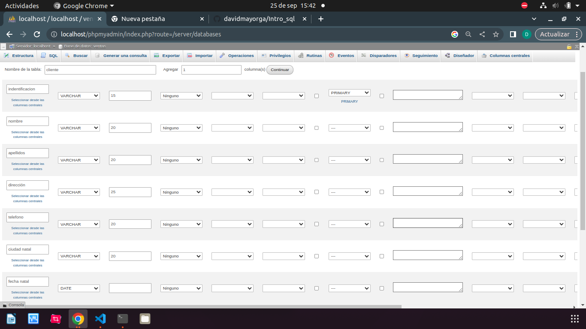
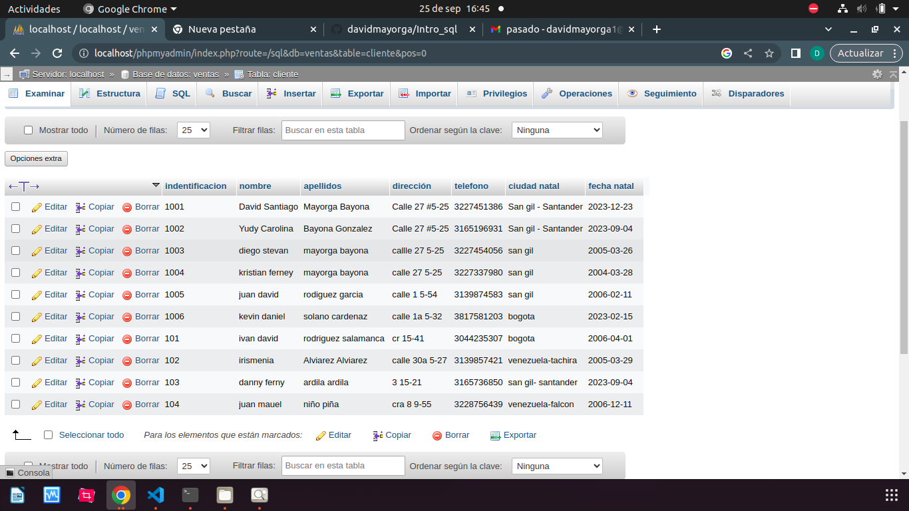

# INTRODUCCIÓN A SQL

1. Creación de una base de datos (BD) con MySQL usando phpMyAdmin

## Creacion tabla Cliente 
### Diccionario de datos
|Campo|Tipo de dato|Longit|
|-----|------------|------|
|***identificación***|varchar|15|
|nombre|varchar|20|
|apellidos|varchar|20|
|dirección|varchar|25|
|telefono|varchar|20|
|ciudad_nac|varchar|20|
|fecha_nac|varchar||

### codigo SQL de creacion de la tabla cliente 
CREATE TABLE `Ventas`.`Cliente` (`identificacion` VARCHAR(15) NOT NULL , `nombre` VARCHAR(20) NOT NULL , `apellidos` VARCHAR(20) NOT NULL , `direccion` VARCHAR(25) NOT NULL , `telefono` VARCHAR(20) NOT NULL , `ciudad_nac` VARCHAR(20) NOT NULL , `fecha_nac` DATE NOT NULL , PRIMARY KEY (`identificacion`)) ENGINE = InnoDB;

## codigo SQL de inserción de un registro a la tabla cliente
INSERT INTO `cliente` (`indentificacion`, `nombre`, `apellidos`, `direccion`, `telefono`, `ciudad_nac`, `fecha_nac`) VALUES ('114', 'david santiago', '', 'calle 27 5-25', '1005', 'san gil', '2006-12-23');

### Registro de datos en tabla clientes

